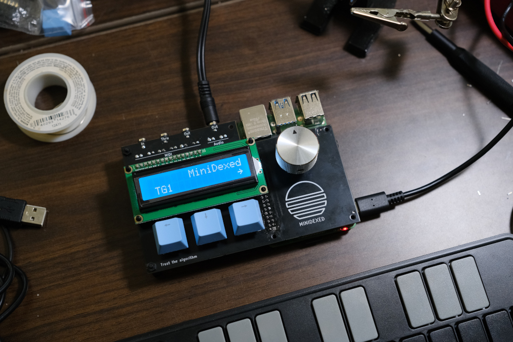
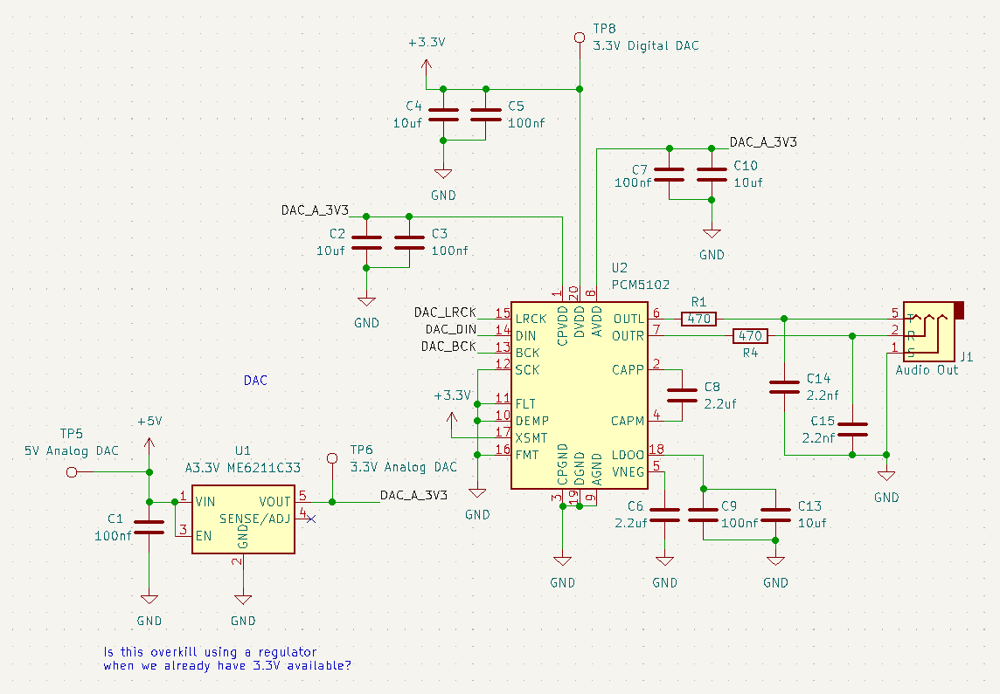
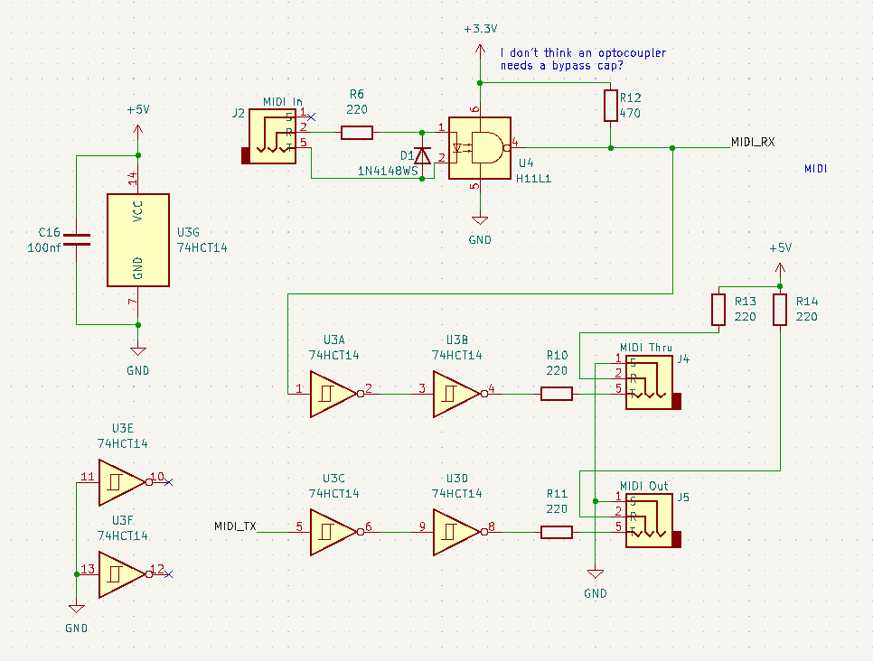
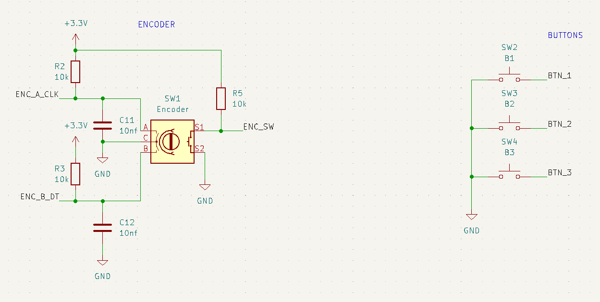
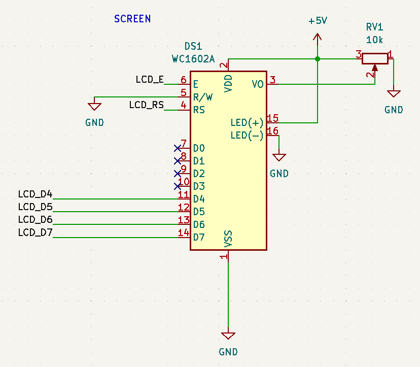

> [!CAUTION]
> This project was made by a JavaScript developer, not an electrical engineer.
>
> It should be assumed that everything is wrong and the project will set your house on fire.
>
> I am not responsible for anything ever.





# MiniDexed PCB

Custom PCB for [MiniDexed](https://github.com/probonopd/MiniDexed), an open-source FM synthesizer. It has:

- An endless encoder
- 3 Cherry buttons (back/home/select)
- A 1602 display
- 3.5mm TRS MIDI in/thru/out
- USB MIDI
- 3.5mm TRS audio out (via the PCM5102 DAC)

Thanks to lots of folks!

- [probonopd](https://github.com/probonopd) and the whole MiniDexed team
- [diyelectromusic](https://diyelectromusic.com/) for MiniDexed work and PCB design notes
- The whole [Dexed](https://github.com/asb2m10/dexed) lineage
- The [KiCad](https://www.kicad.org/) maintainers

## Builds

Look in `/gerbers/` for build files and BOMs.

### 20240727

Working with the [MiniDexed 2024-01-16 release](https://github.com/probonopd/MiniDexed/releases/tag/2024-01-16).

No known issues (although MIDI out is untested right now). The whole thing is about the size of a Korg NTS-1 and costs roughly $15/PCB to make (including SMT assembly and SMT parts; not including the Pi, THT components, or shipping).

Required changes to `minidexed.ini`:

```
# Sound device
SoundDevice=i2s
#SoundDevice=pwm
#SoundDevice=hdmi

# ...unchanged...

ButtonPinBack=16
ButtonActionBack=click
ButtonPinSelect=27
ButtonActionSelect=click
ButtonPinHome=26
ButtonActionHome=click

# ...unchanged...
```





